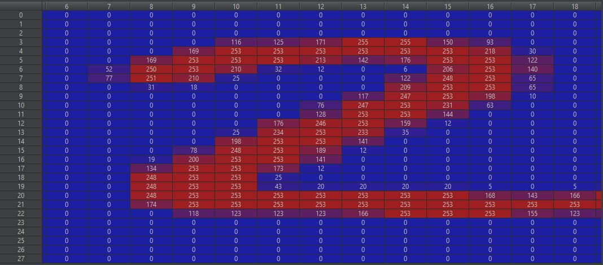
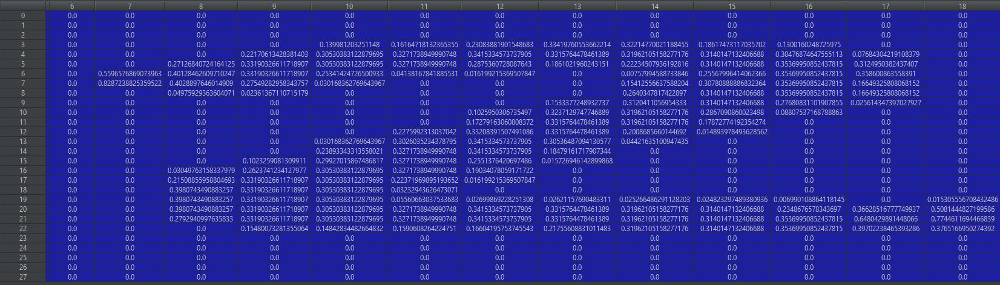
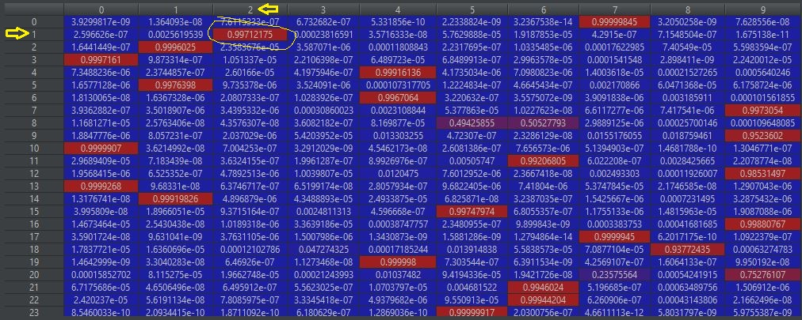
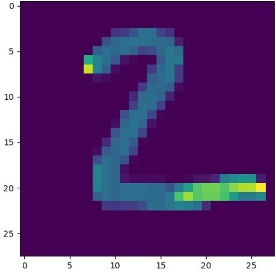

# Deep Learning - Neural network 3 layers

Neural network of 3 layers for recognizing the number drowned in an image of size `28x28` pixel. 

### How the algorithm works?
1. Loads a set of data using `Keras` library and split them in 2 categories
    - Train data
        - `x_train` Matrix input `[[28x28], [28x28], [28x28], ...]`, 
        where each element of the matrix is a matrix itself containing the `image` of a number in size `28x28` pixel.
        Each element of the matrix is a pixel color within the range `0(white)-255(black)`.
        - `y_train` Array output `[7, 2, 5, ...]`, 
        with corresponding output of each matrix.  First matrix of `x_train` is a "7", etc.
    - Test data
        - `x_test` Matrix input.
        - `y_test` Array output.
2. Normalizes both inputs `Train` and `Test` data from `0 to 250` to `0.0 to 1.0`
3. Builds a model with 3 layers with 128, 128 and 10 neurons each.
4. Fits the Training data into the model and trains the model for 3 time.
    - Evaluates the Loss and the Accuracy of the model after training
6. Predicts output for the Test data. 
7. Verifies the prediction, printing the second element of the output, which is a "2". 

### Some data
`x_test[1]` <br/>
&nbsp;&nbsp;&nbsp;&nbsp;
  <br/>

First row of the `prediction` matrix has the highest value in the column representing the value "2".<br/>
&nbsp;&nbsp;&nbsp;&nbsp;&nbsp;&nbsp;&nbsp;&nbsp;
 

[Output Console](./doc/console.txt)

### Prerequisites
- Python
- TensorFlow is an open-sourced end-to-end platform, a library for multiple machine learning tasks.
- Keras is a high-level neural networks library that is running on the top of TensorFlow

```
pip install --upgrade --user tensorflow
```

To solve: Error: Could not load dynamic library 'cudart64_110.dll'; dlerror: cudart64_110.dll not found
```
pip install tf-nightly
```

### See 
- [Youtube tutorial](https://www.youtube.com/watch?v=wQ8BIBpya2k)
- [Full tutorial](https://pythonprogramming.net/introduction-deep-learning-python-tensorflow-keras/)
- [TensorFlow Docs](https://www.tensorflow.org/api_docs/python/tf/all_symbols)
- [Keras Docs](https://keras.io/api/layers/)
- [Back to bigdata_and_ai](https://github.com/ermalaliraj/bigdata_and_ai)