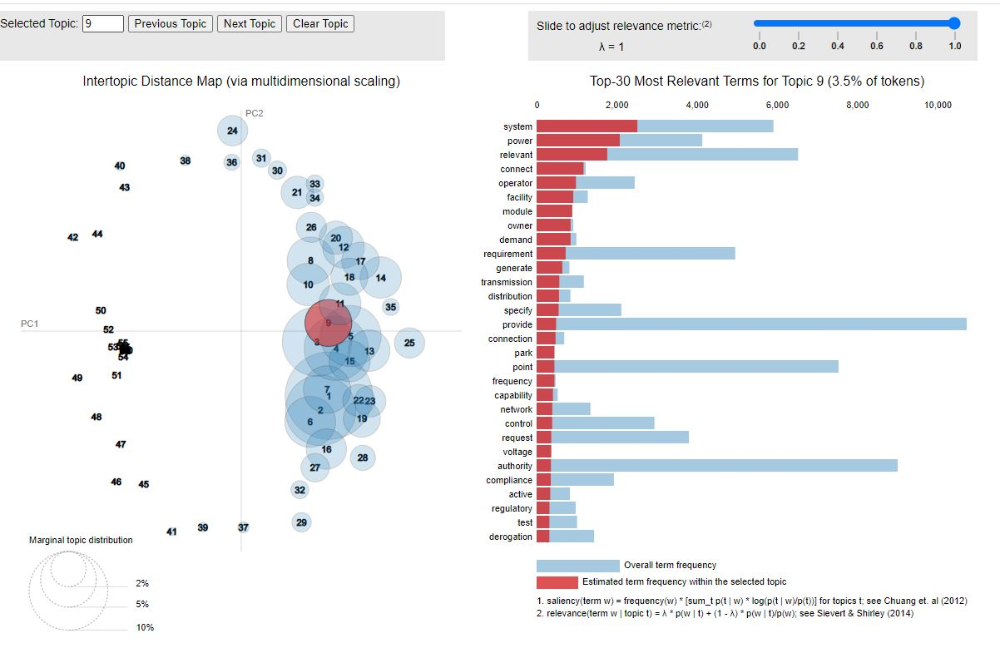
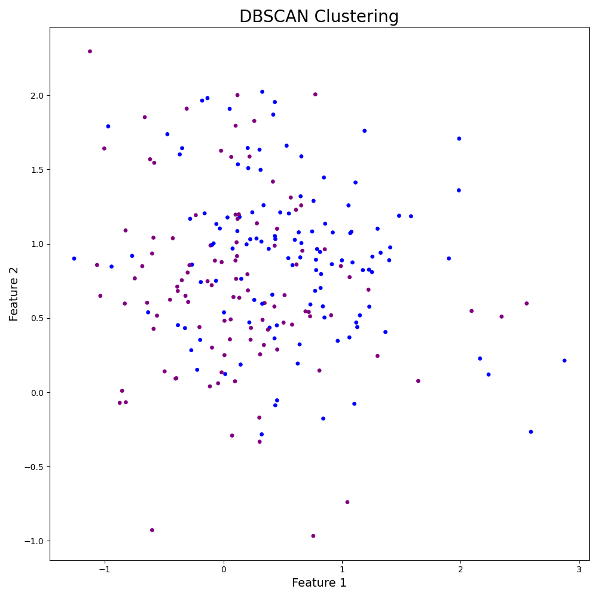
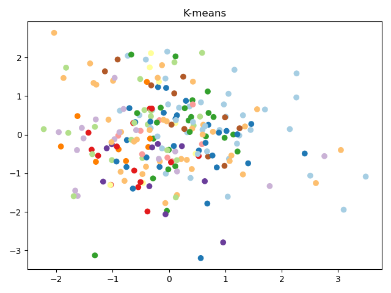

# LDA for OJ Regulations download form EUR-Lex

### 1. Build the model 
`load_data_and_create_LDA.py`

### 2. See the Topics distribution using gensimvis
`load_model_and_showTopicsWithGensimvis.py`

### 2. Run LDA Topic clustering and DBSCAN
`load_model_and_DBSCAN.py`

### 2. Run K-Means
`load_model_and_KNN.py.py`

### Links
- [Back to bigdata_and_ai](https://github.com/ermalaliraj/bigdata_and_ai) 