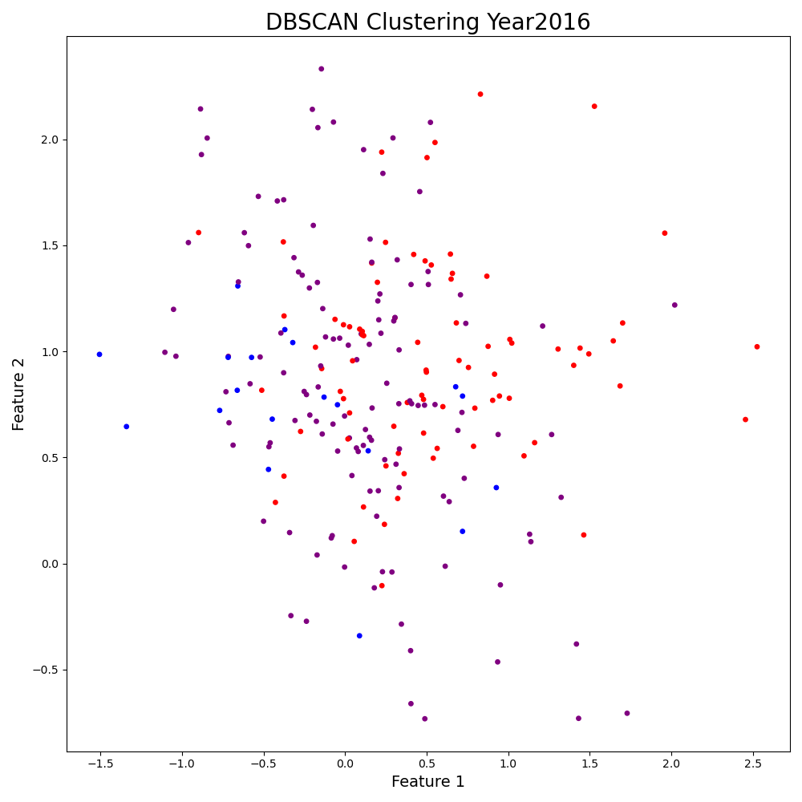
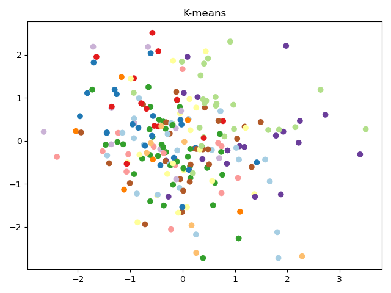

# LDA for OJ Regulations download form EUR-Lex

### 1. Build the model 
`load_data_and_create_LDA.py`

### 2. See the Topics distribution using gensimvis
`load_model_and_showTopicsWithGensimvis.py`
Download and consult on your own the generated html file `LDA_Regulation_topics.html`

### 2. Run LDA Topic clustering and DBSCAN
`load_model_and_DBSCAN.py`

### 2. Run K-Means
`load_model_and_KNN.py.py`

### Links
- [spacy](https://spacy.io/models)  
- [NLP example](https://towardsdatascience.com/nlp-building-text-cleanup-and-preprocessing-pipeline-eba4095245a0)
- [Back to bigdata_and_ai](https://github.com/ermalaliraj/bigdata_and_ai) 