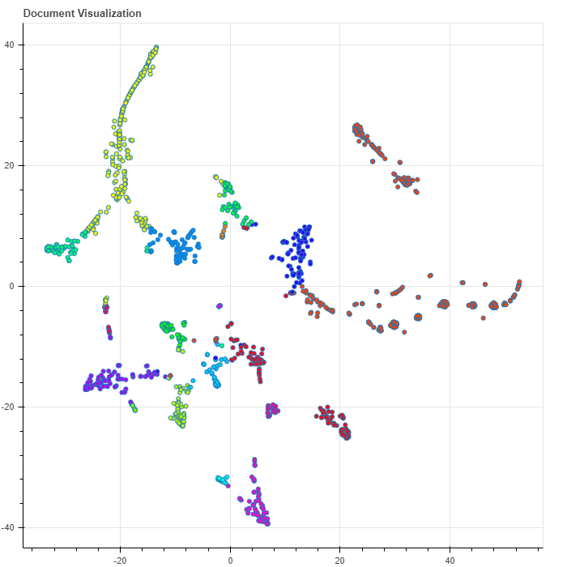
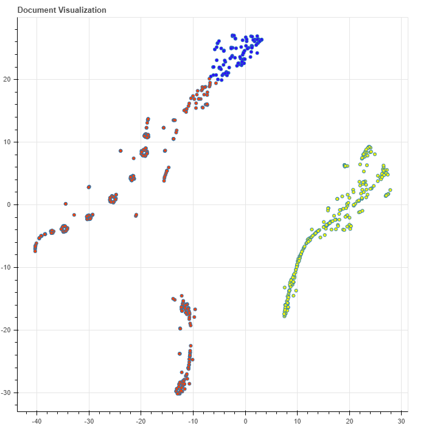

# Topic Modeling using LDA (Latent Dirichlet Allocation )

Cluster the documents into different topics

To run the repository follow the steps:

1. Clone the repository:

      git clone https://github.com/........
      
2. Install Requirements:

    pip install -r requirements.txt

3. Train The Model:

    python train_model.py

4. Run the model:

    python get_prediction.py
    
5. Enter your text. The model would predict the topic and other documents related to it.


# Visualizations

`model.print_topics(show_counts=True)`
```
topic:1 | count:319 | fishing agency management board paragraph joint vessel activity national including
topic:4 | count:230 | food mrls substance product maximum residue efsa existing risk safety
topic:17 | count:94 | financial programme support fund action objective cap development including payment
topic:19 | count:91 | entity person body legal natural listed economic cfsp good data
topic:14 | count:73 | product animal control point paragraph competent act health plant medicinal
topic:0 | count:70 | undertaking product period producer import price market custom country industry
topic:21 | count:70 | institution paragraph financial risk competent point resolution exposure requirement credit
topic:10 | count:58 | substance restriction directive eec chemical classification agency mixture acer packaging
topic:5 | count:56 | vehicle emission directive type-approval technical manufacturer transport engine requirement approval
topic:24 | count:50 | data personal right processing protection law person national subject purpose
topic:9 | count:50 | breeding paragraph aid mark trade point animal replaced registered wine
topic:8 | count:41 | air aviation energy climate emission aircraft directive greenhouse gas requirement
topic:13 | count:36 | relevant market service assessment power requirement capacity paragraph operator point
topic:22 | count:25 | border national etias data visa point third-country travel central schengen
topic:23 | count:19 | flavouring republic list african central substance fge congo group arm
topic:12 | count:17 | reporting data ecb statistical central agent bank credit national ncbs
topic:2 | count:12 | geographical spirit indication drink labelling protection specification presentation alcohol description
topic:6 | count:11 | dprk korea north vessel paragraph prohibited transfer point competent financial
topic:20 | count:6 | eures worker labour partner milk job network employer organisation mobility
topic:3 | count:2 | safety conformity component subsystem body assessment notified installation market notifying
topic:16 | count:1 | holder pension allowance data death public regulations holders sickness orphan
```


```
small_set_topics = model.get_doctopics(topic_ids=[1, 4, 17])
model.visualize_documents(doc_topics=small_set_topics)
```

 

See `ipython` rendered [here](https://nbviewer.org/github/ermalaliraj/bigdata_and_ai/blob/main/ai/eur-lex-integration/python_ktrain/eur-lex-integration_LDA_ktrain.ipynb)


### Links 
- [ktrain](https://pythonrepo.com/repo/amaiya-ktrain-python-deep-learning)
