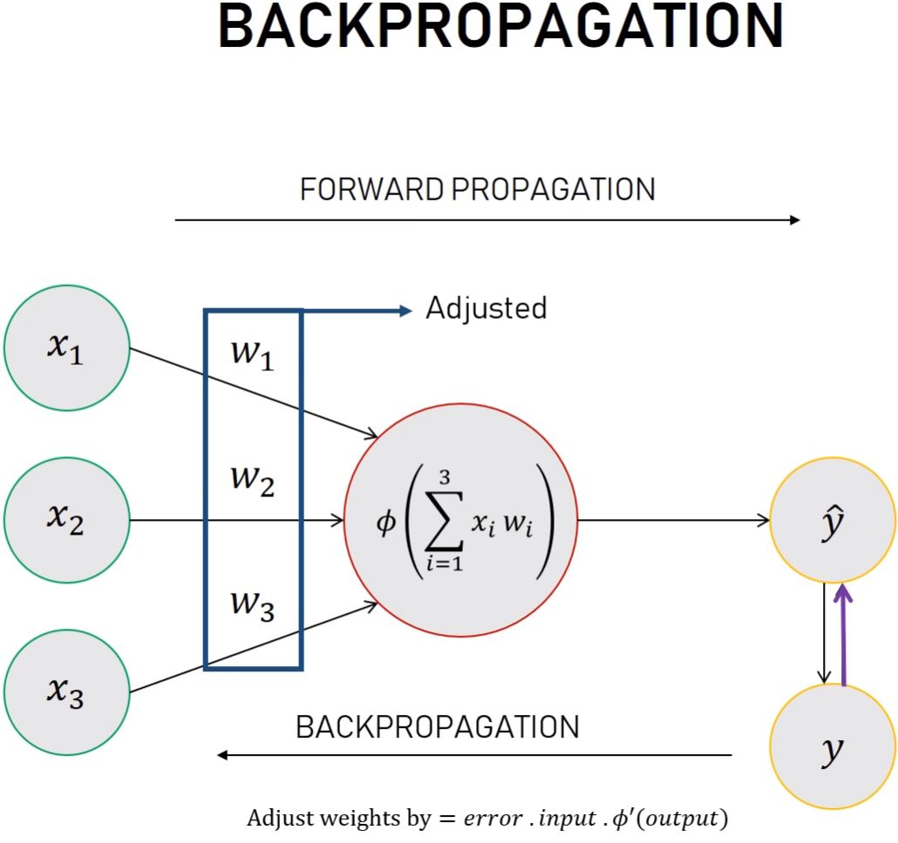

# Simple Neural Network

Creating a simple neural network in Python with one input layer (3 inputs) and one output neuron. 

## How it works?
`simple_neural_net.py` tries to predict the output given 3 binary inputs. 
If the first input is 1, the output should be 1, otherwise the output should be 0.
`main.py` object to be used to pass input dynamically.

## Neural Network theory
A neural network with no hidden layers is called a `perceptron`. 
In the `simple_neural_net.py` the neural network is trained. 

&nbsp;&nbsp;&nbsp;&nbsp;&nbsp;&nbsp;&nbsp;&nbsp;&nbsp;&nbsp;&nbsp;
   
&nbsp;&nbsp;&nbsp;&nbsp;&nbsp;&nbsp;&nbsp;&nbsp;&nbsp;&nbsp;&nbsp;
   
&nbsp;&nbsp;&nbsp;&nbsp;&nbsp;&nbsp;&nbsp;&nbsp;&nbsp;&nbsp;&nbsp;
   

## See
- [Yotube tutorial original project](https://www.youtube.com/watch?v=kft1AJ9WVDk)
- [GIT Original project](https://github.com/jonasbostoen/simple-neural-network)
- [Milo Spencer-Harber website - Simple Neural Network](https://medium.com/technology-invention-and-more/how-to-build-a-simple-neural-network-in-9-lines-of-python-code-cc8f23647ca1)
- [Andrew Trask website - Basic Python Network](https://iamtrask.github.io/2015/07/12/basic-python-network/)

- [Back to bigdata_and_ai](https://github.com/ermalaliraj/bigdata_and_ai)

