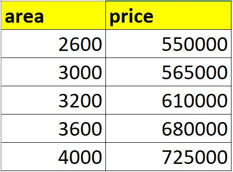
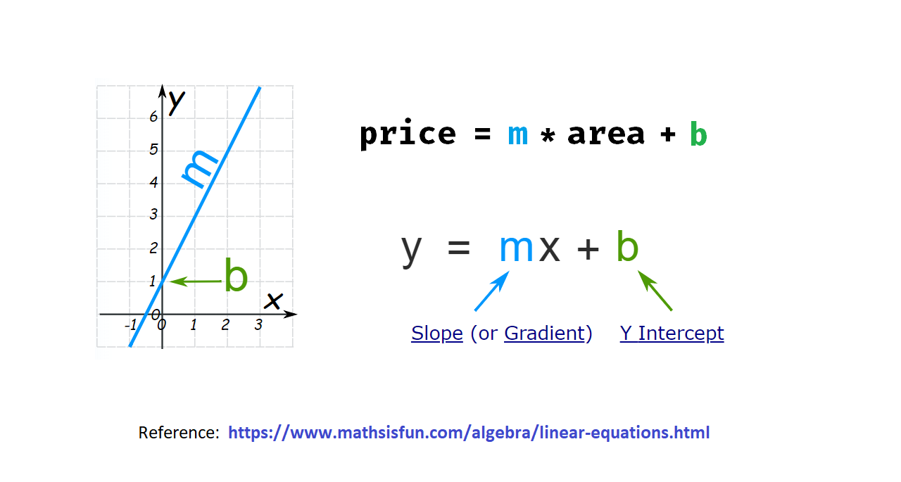

# Simple Linear regression

Given the following home prices find out prices of homes whose area is: 3300 (300) m2.

   

### How the algorithm works?

Blue line best fits the data points.
   

We can deduce that a house of 3300 ft costs 628715

Calculate each error with the line, square and sum them up and try to minimise it until you find the optimal line.

   

Linear equation   
   

| First Header  | Second Header |
| ------------- | ------------- |
| Content Cell  | Content Cell  |
| Content Cell  | Content Cell  |
  
### Prerequisites
- Python

# See
- [Youtube Tutorial](https://www.youtube.com/watch?v=8jazNUpO3lQ)
- [Git Hub Tutorial](https://github.com/codebasics/py/tree/master/ML)
- [Back to bigdata_and_ai](https://github.com/ermalaliraj/bigdata_and_ai)