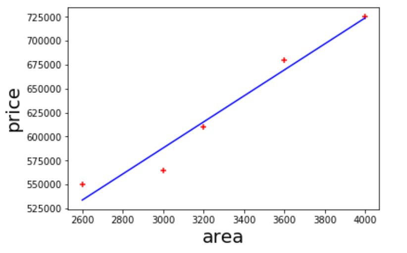

# Machine Learning - Linear regression Single Variable

Given the following home prices find out prices of homes whose area is: 
- 3300 square feet
- 5000 square feet

   

### Linear regression approach

Scatter plot with available prices and areas. 
(red points available points, blue line best fits the data points) 
   

We can deduce that a house of 3300 sf costs 628715  
   

### How do we trace the line?

Calculate each error with the line, square and sum them up and try to minimise it until you find the optimal line. 

 

### Linear equation 

### Prerequisites
- Python
- scikit-learn library

# See
- [Youtube Tutorial](https://www.youtube.com/watch?v=8jazNUpO3lQ)
- [Git Hub Tutorial](https://github.com/codebasics/py/tree/master/ML)
- [scikit-learn](https://scikit-learn.org/stable/)
###
- [Back to Bid Data & AI](https://github.com/ermalaliraj/bigdata_and_ai)