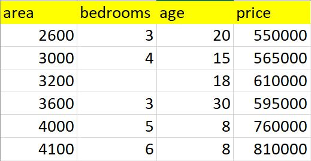

# Machine Learning - Linear regression Multiple Variables (Multivariate Regression)

Given the following home prices find out prices of homes whose area is: 
- 3300 square feet
- 5000 square feet

  <br/>

### Linear equation 

```
    area  bedrooms  age   price
0  2600       3.0   20  550000
1  3000       4.0   15  565000
2  3200       NaN   18  610000
3  3600       3.0   30  595000
4  4000       5.0    8  760000
5  4100       6.0    8  810000
```


###  Steps
- Data Processing: Handling NA values
- Linear Regression Using Multiple Variables


### Prerequisites
- Python
- scikit-learn library


# See
- [Youtube Tutorial](https://www.youtube.com/watch?v=J_LnPL3Qg70)
- [Git Hub Tutorial](https://github.com/codebasics/py/tree/master/ML)
- [Back to bigdata_and_ai](https://github.com/ermalaliraj/bigdata_and_ai)