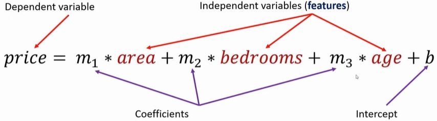

# Machine Learning - Linear regression Multiple Variables (Multivariate Regression)

Given the following home prices find out prices of homes whose area is: 
- 3000 square feet area, 3 bedrooms, 40 year old
- 5000 square feet area, 4 bedrooms, 5 year old

```
    area  bedrooms  age   price
0  2600       3.0   20  550000
1  3000       4.0   15  565000
2  3200       NaN   18  610000
3  3600       3.0   30  595000
4  4000       5.0    8  760000
5  4100       6.0    8  810000
```

### Linear equation 

- Data Processing: Handling NA values
- Linear Regression Using Multiple Variables



```
predict area_3000 bedrooms_3 age_15:  [579201.19929613]
predict area_3000 bedrooms_5 age_5:  [602264.91756727]

predict area_3000 bedrooms_1 age_15:  [532423.43914025]
predict area_3000 bedrooms_2 age_15:  [555812.31921819]
predict area_3000 bedrooms_3 age_15:  [579201.19929613]
predict area_3000 bedrooms_5 age_15:  [625978.95945201]
predict area_3000 bedrooms_8 age_15:  [696145.59968583]

predict area_3000 bedrooms_1 age_30:  [483947.67051076]
predict area_3000 bedrooms_2 age_30:  [507336.5505887]
predict area_3000 bedrooms_3 age_30:  [530725.43066664]
predict area_3000 bedrooms_5 age_30:  [577503.19082251]
predict area_3000 bedrooms_8 age_30:  [647669.83105633]
```


### Exercise 2

Given the following salaries, find out the salary the HR department should offer to a candidate with: 
- 2 years of experience, 9 test scores, 6 interview scores
- 12 years of experience, 10 test scores, 10 interview scores

```
   experience  test_score(out of 10)  interview_score(out of 10)  salary($)
0        NaN                    8.0                           9      50000
1        NaN                    8.0                           6      45000
2       five                    6.0                           7      60000
3        two                   10.0                          10      65000
4      seven                    9.0                           6      70000
5      three                    7.0                          10      62000
6        ten                    NaN                           7      72000
7     eleven                    7.0                           8      80000
```

Answer:
- 2 years of experience, 9 test scores, 6 interview scores => 53205$
- 12 years of experience, 10 test scores, 10 interview scores = 92002$

### Prerequisites
```
pip install --user scipy
pip install word2number
```


# See
- [Youtube Tutorial](https://www.youtube.com/watch?v=J_LnPL3Qg70)
- [Git Hub Tutorial](https://github.com/codebasics/py/tree/master/ML)
- [Back to bigdata_and_ai](https://github.com/ermalaliraj/bigdata_and_ai)