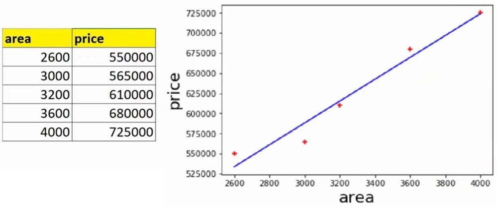
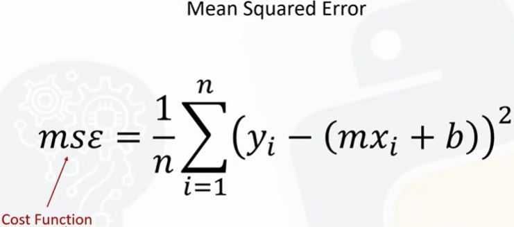
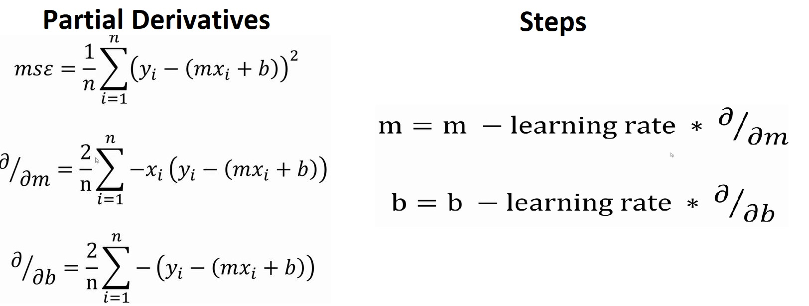
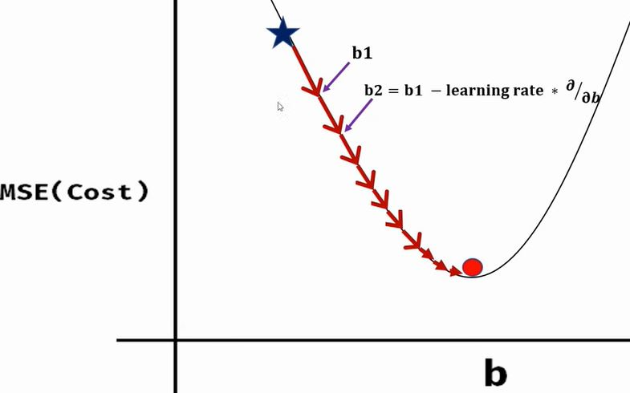
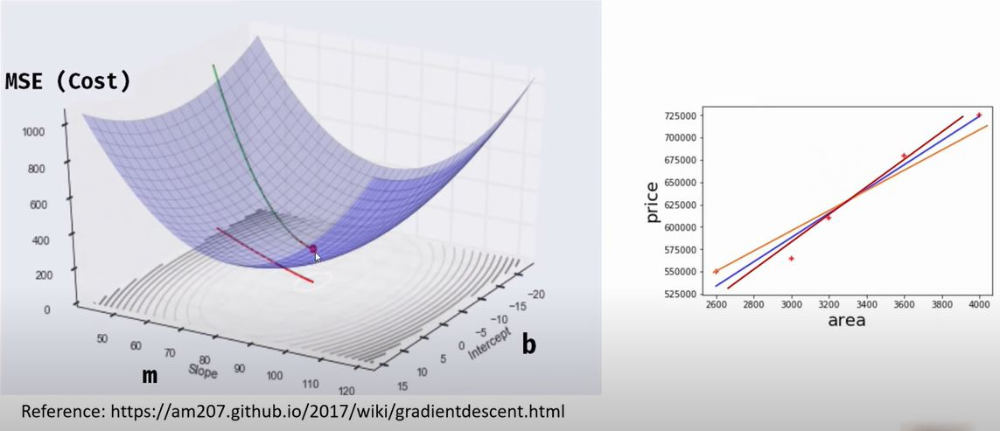
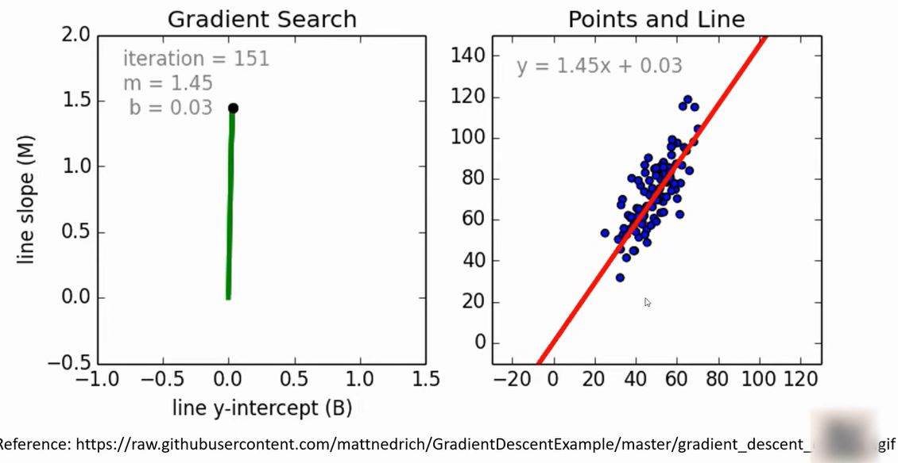
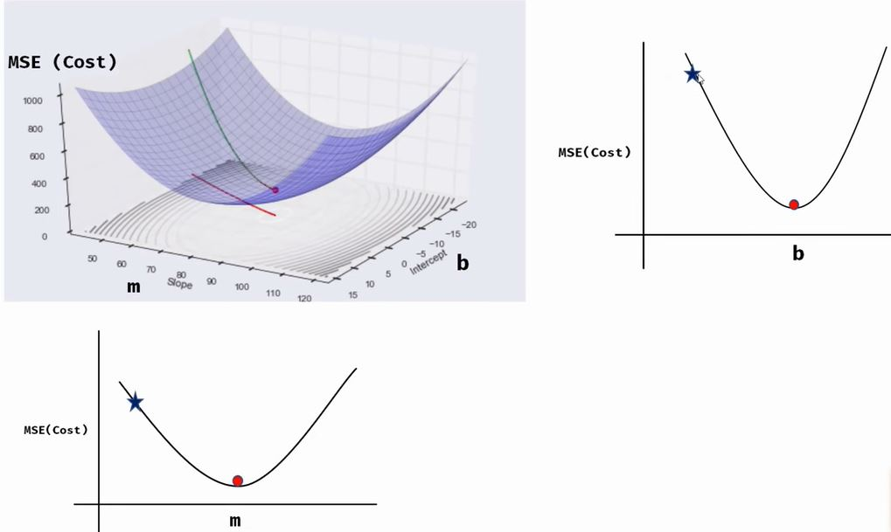
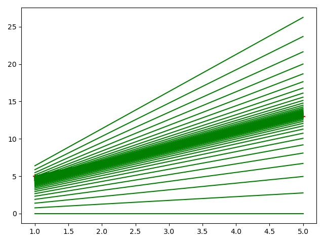

# Machine Learning - Gradient Descent and Cost Function

### Linear equation 
```
Given
y = 2x + 3
x = [1, 2, 3, 4, 5]
We find
y = [5, 7, 9, 11, 13]
```

In case of Machine Learning starting from the training dataset X and Y we try to deduct the equation 
also known as `prediction function`. We can use this equation to predict future values of x.

In home prices prediction (1), we come up with the following equation:
```
area = [2600, 3000, 3200, 3600, 4000]
price = [550k, 565k, 610k, 680k, 725k]
price = 135.78 * area + 180616.43   
price = Coeff  * area + Intercept
```

The `prediction function` in this case is the blue line.

How to know where the best line stand?

#### Mean Squared Error

1) Draw any random line
2) Calculate the error between your data point and the point predicted by the line prediction.
3) Collect all the deltas for all the points and square them. Square because some delta could be negative.
4) Sum up all the calculated distances and divide by n; where n is the number of available data points. 5 in our example.



#### Cost function

### Gradient decent 
Gradient decent is an algorithm that finds best fit line for given training data set.

To calculate Mean Squared Error (MSE):
1. Partial derivative of b and partial derivative of m, which gives us the direction
2. Calculate steps, using learning rate

We follow the curvature, so we can do on each step:
1. Each point, we calculate the `slope`
3. With the slope we know where the direction is
3. We use `learning rate` in conjunction with slope to calculate the step and reach the next point












#### Learning rate

### Exercise 2

Given Mathematic and Computer Science test scores, find correlation between those scores.

```
     name  math  cs
0   david    92  98
1   laura    56  68
2  sanjay    88  81
3     wei    70  80
4    jeff    80  83
5   aamir    49  52
6  venkat    65  66
7   virat    35  30
8  arthur    66  68
9    paul    67  73
```

- Math will be X axe, and CS will be Y.
- Will find value for `m` and `b` by applying Gradient Decent algorithm.
- Compare the cost between each iteration and exit if is in within a certain threshold.
- Find out how many iteration we need to figure out the value of `m` and `b`.
- Lately compare Coefficient and Intercept with the `sklearn` `LinearRegression`.

# See
- [Youtube Tutorial](https://www.youtube.com/watch?v=vsWrXfO3wWw)
- [Git Hub Tutorial](https://github.com/codebasics/py/tree/master/ML)
- [Back to bigdata_and_ai](https://github.com/ermalaliraj/bigdata_and_ai)

