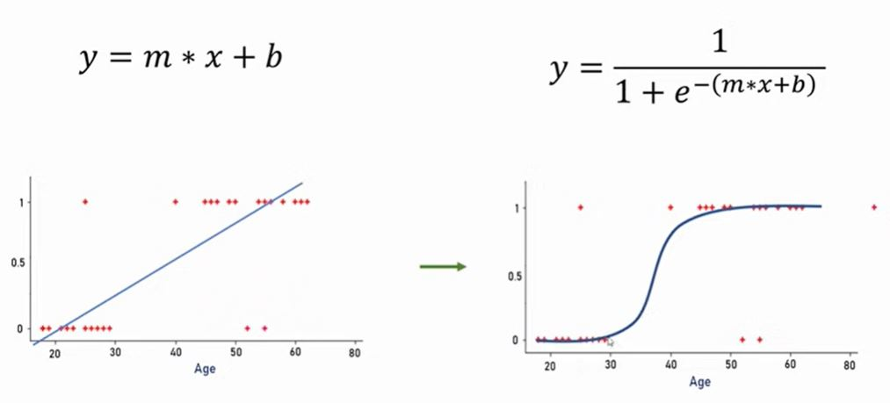

# Machine Learning - Train/Test split data

### Sigmoid function

# See
- [Youtube Tutorial](https://www.youtube.com/watch?v=zM4VZR0px8E)
- [Git Hub Tutorial](https://github.com/codebasics/py/blob/master/ML)

https://www.kaggle.com/jacksonchou/hr-analytics

- [Back to bigdata_and_ai](https://github.com/ermalaliraj/bigdata_and_ai)

