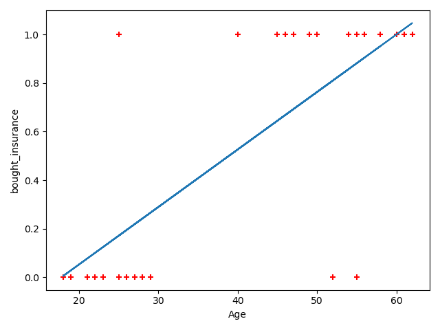
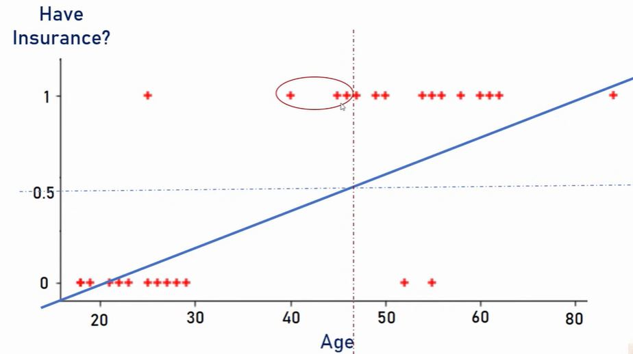

# Machine Learning - Logistic Regression

`Logistic regression` is used for solving `classification` problems.

`Linear regression` predict __continuous__ values:
- Home prices
- Weather
- Stock prices

`Logistic regression` predict __categorical__ value:
- Email is spam or not spam
- Will the customer buy life insurance
- Which party a person is going to vote for?
    - Democratic
    - Republican
    - Independent

Binary classification when Yes/No, or multiclass classification when 1 between 3 options.


### Problem Description
Build a Machine learning model that can predict based on the age.

```
age have_insurance
22	0
25	0
47	1
52	0
46	1
56	1
55	0
60	1
62	1
61	1
18	0
...
```

First temptation is to use Linear regression. <br/>


The issue shows up when we add more "extreme" data to the model. Imagine we have data for an 84 old person which buy a insurance. <br/>
In this case the model will not correctly predict persons of age 40. <br/>


To solve this situation, we need a line at 0,5 values, called Sigmoid function.<br/>

### Sigmoid function


### Exercise
Download employee retention dataset from here: https://www.kaggle.com/giripujar/hr-analytics.
1. Now do some exploratory data analysis to figure out which variables have direct and clear impact on employee retention 
(i.e. whether they leave the company or continue to work)
2. Plot bar charts showing impact of employee salaries on retention
3. Plot bar charts showing correlation between department and employee retention
4. Now build logistic regression model using variables that were narrowed down in step 1
5. Measure the accuracy of the model"


# See
- [Youtube Tutorial](https://www.youtube.com/watch?v=zM4VZR0px8E)
- [Git Hub Tutorial](https://github.com/codebasics/py/blob/master/ML)
###
- [Back to Bid Data & AI](https://github.com/ermalaliraj/bigdata_and_ai)

