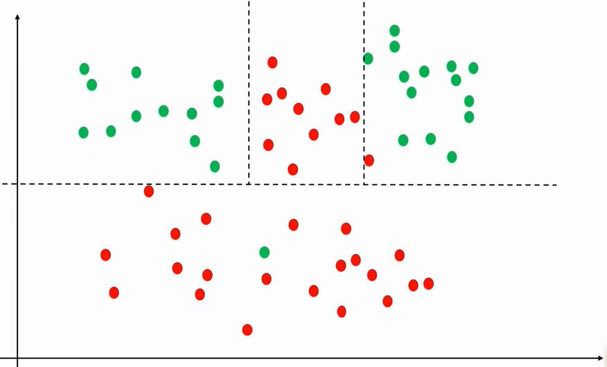
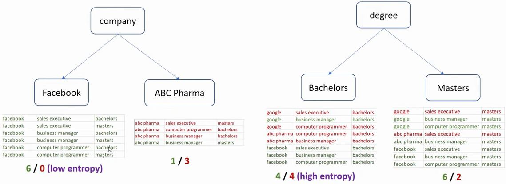
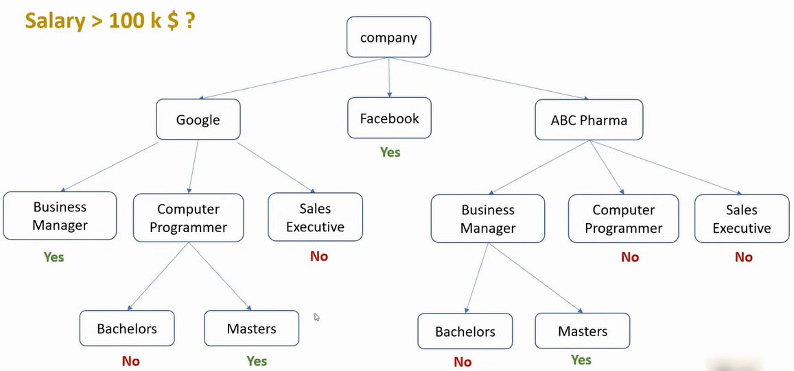
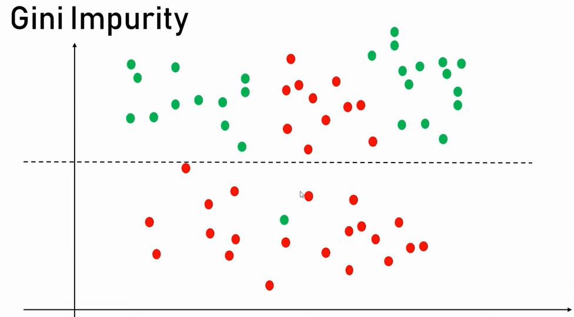

# Machine Learning - Decision Tree

`Decision Tree` is used for solving `classification` problems. 
Some time is not easy to trace a decision boundary using Logistic regression.
If the data set is more complex we cannot trace a single line, instead the data set has to be split again ang again 
to come up with the decision boundaries.

### Find Salaries more that 100k
|company|job|degree|salary_more_then_100k|
|---|---|---|---|
| google  |sales executive|  bachelors | 0  |
| google  |sales executive|  masters | 0  |
| google  |sales manager|  bachelors | 1  |
| google  |sales manager|  masters | 0  |
| google  |computer programmer|  bachelors | 0  |
| google  |computer programmer|  masters | 1  |
| abc pharma  |sales executive|  masters | 0  |
| abc pharma  |computer programmer|  bachelors | 0  |
| abc pharma  |business manager|  bachelors | 0  |
| abc pharma  |business manager|  masters | 1  |
| facebook  |sales executive|  bachelors | 1  |
| facebook  |sales executive|  masters | 1  |
| facebook  |business manager|  bachelors | 1  |
| facebook  |business manager|  masters | 1  |
| facebook  |computer programmer|  bachelors | 1  |
| facebook  |computer programmer|  masters | 1  |

### Entropy
Entropy is the measure of randomness.
- Low entropy, high information gain, GOOD 
- High entropy, low information gain, BAD

### 

It maters in which order we split the tree.  

### 

# See
- [Youtube Tutorial](https://www.youtube.com/watch?v=PHxYNGo8NcI)
- [Git Hub Tutorial](https://github.com/codebasics/py/blob/master/ML)
###
- [Back to Bid Data & AI](https://github.com/ermalaliraj/bigdata_and_ai)

