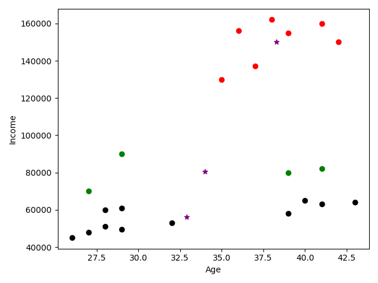

# K-Means Clustering Algorithm

Read data from a `CVS` file and group them based on `Age` and `Income`.  
Unsupervised technique. 

### How the algorithm works?
1. Read the file as a `DataFrame` (table) with columns `Name`, `Age`, `Income`
2. Create a `KMeans` algorithm with 3 clusters
3. Make a first prediction and split the data in 3 categories: 0, 1 and 2
    - Append this info as the last column inside the `DataFrame`. All columns: `Name`, `Age`, `Income`, `cluster` 
4. Normalize the values in the scale of `[0,1]` for `Age` and `Income`
5. Use again the `KMeans` algorithm to train the scaled dataset
6. Make another prediction overriding the column `cluster`
7. Use `inertia_` parameter of KMeans which provides `Sum of squared error` and show the `Elbow` plot to find out which is the ideal number of clusters to be used

__Clustering original data__  
   
__Normalize the data to have the same range in X and Y axes.__   
     
__Sum of squared error - Ideal number of clusters 3__  
   

### Prerequisites
- Python
- sklearn library

# See
- [Youtube Tutorial](https://www.youtube.com/watch?v=EItlUEPCIzM)
- [Git Hub Tutorial](https://github.com/codebasics/py/blob/master/ML/13_kmeans/13_kmeans_tutorial.ipynb)
- [Back to bigdata_and_ai](https://github.com/ermalaliraj/bigdata_and_ai)
- [K Means wikipedia](https://en.wikipedia.org/wiki/K-means_clustering)