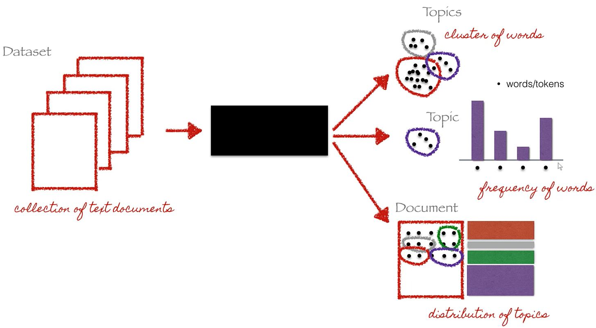

# Latent Dirichlet Allocation 

Divide documents by topic they talk too. 

### Latent Dirichlet Allocation 
`Latent Dirichlet Allocation`  is a machine that produces documents.

### Dirichlet Distributions
`Dirichlet Distributions` we have parameter ` alpha` 
- 1, uniform on the left.
- < 1, uniform to the corners.
- > 1, uniform at the center.
 
 
### Two Dirichlet Distributions

  

The one on the left associates documents with their corresponding topics. 
The on on the right associates topics with their corresponding words.

### How to put these together?

 
We put those together rememebring that LDA is a machien that produces documents.
This machine has some settings that we adjust. 
These settings are exactly the `Two Dirichlet Distributions` above.
The way we adjust the settings is by moving the points inside the distributions.
We produce a document for each setting.
 

### Probability that a particular document comes out of a machine


The generated article is just a combiantion of words: Planet, galaxy, ball, plannet, galaxy, referendum, galaxy, ball and referendum.

Using these mode, we generate a collection fo documents and we go back and check if they look like the once we have from the beginning. 
Notice that to every yellow dot in the left distribution a document corresponds. They are according to the topics given by the yellow dots and their position.
<br/>

The probability we get the same article is very low, but we choose the closest to the same.


### 


### When to use?
Document or information extraction.
When you have billions of documents, instead of scanning all documents, you can create related topics for each of the document.
Than you can look inside the topic instead of the document because the looking inside the topic is much faster than looking inside the whole document.


### What is Latent Dirichlet Allocation 
- In Natural language processing the `Latent Dirichlet Allocation (LDA)` is a generative statistical model that allows 
sets of observers to be explained by unobserved groups that explain why some parts pf the data are similar.
- The aim of LDA is to find topics a document belongs to, based on the words in it.

```
"Dogs like to chew on bones and fetch sticks"
"Puppies drink milk."
"Both like to bark."
```

We can easily say it belongs to a topic __DOG_related__ because it contains words such as Dogs, bones, puppies and bark.



### Links 
- [Video Tutorial](https://www.youtube.com/watch?v=T05t-SqKArY&t=822s)
- [LDA news headlines by Susan Li](https://towardsdatascience.com/topic-modeling-and-latent-dirichlet-allocation-in-python-9bf156893c24)
- [LDA news headlines github](https://github.com/susanli2016/NLP-with-Python/blob/master/LDA_news_headlines.ipynb)
- [Introduction to LDA](http://blog.echen.me/2011/08/22/introduction-to-latent-dirichlet-allocation/)
- [Video Tutorial 3](https://www.youtube.com/watch?v=1_jq_gWFUuQ)
- [Video Tutorial -  LDA for Document Clustering | KGPTalkie](https://www.youtube.com/watch?v=pZgYRYUc6Mc)


###
- [Back to bigdata_and_ai](https://github.com/ermalaliraj/bigdata_and_ai) 