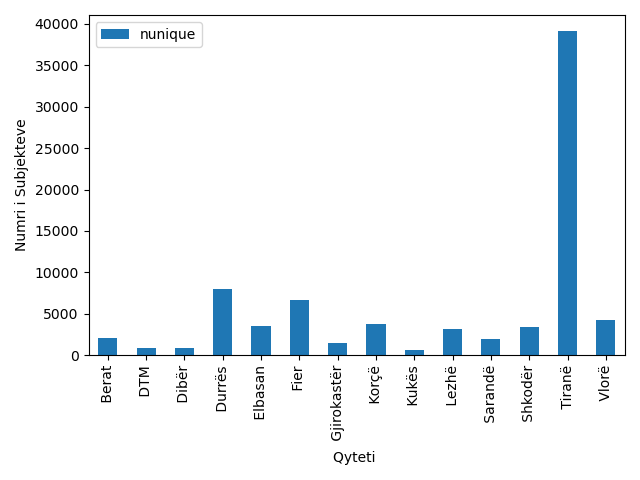
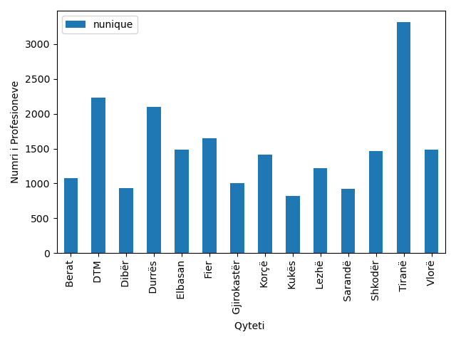
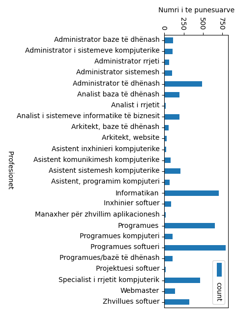
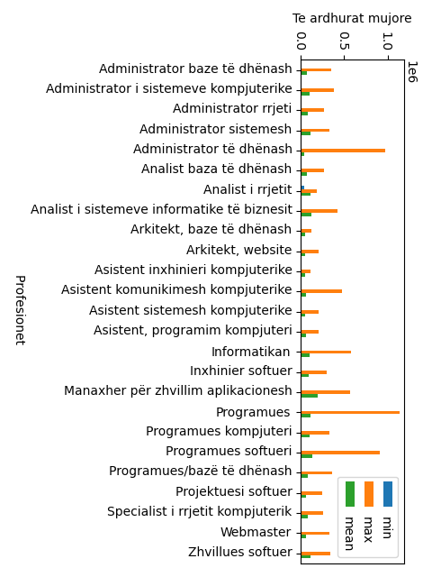
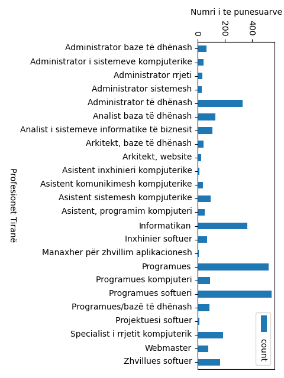
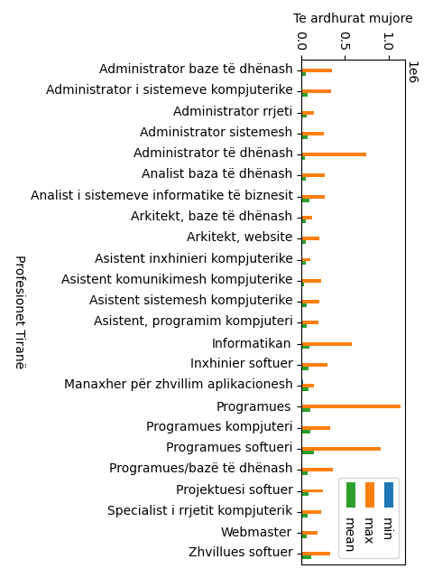
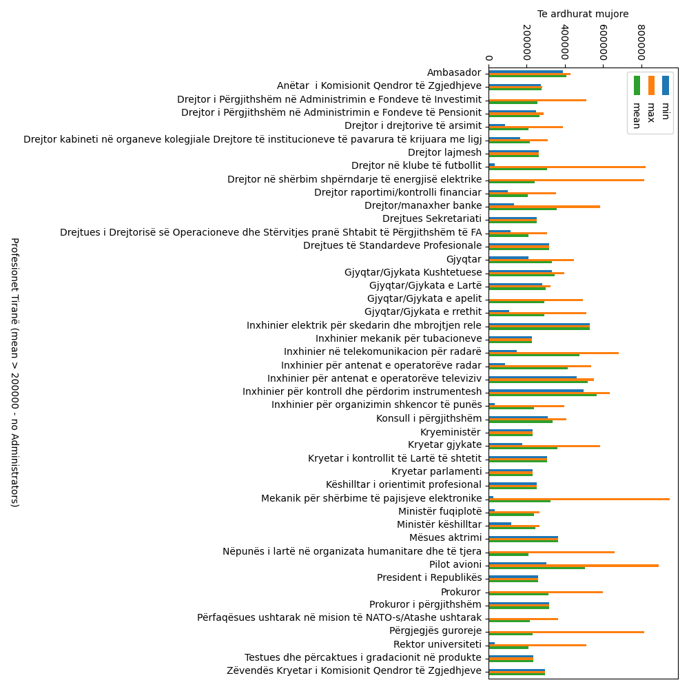

# Payments 

Python application to scan and plot statistics from an excel file.

### Law compliant
- No data used for the graphs generation will be distributed as part of this application.
- You can use your own data, adjusting column names.
- No Personally Identifiable Information (PII) is present in the graph.

### Number of Companies and Number of employees in Albania
 &nbsp;&nbsp;

### Payments in Albania in IT field
&nbsp;&nbsp;

### Payments in Tirana in IT field
&nbsp;&nbsp;

### Highest payments in Albania based on the average (over 200.000 LEK)

- [Back to Bid Data & AI](https://github.com/ermalaliraj/bigdata_and_ai)